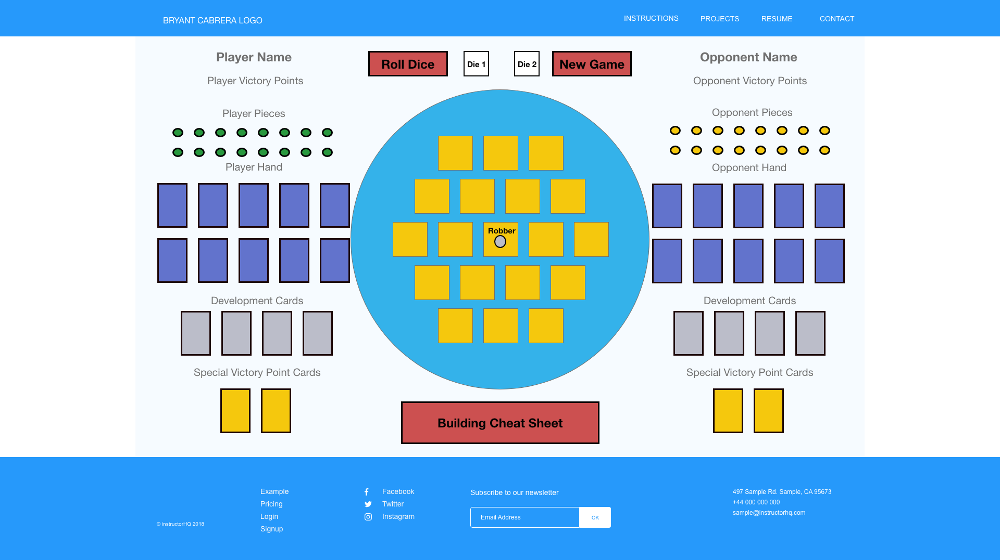
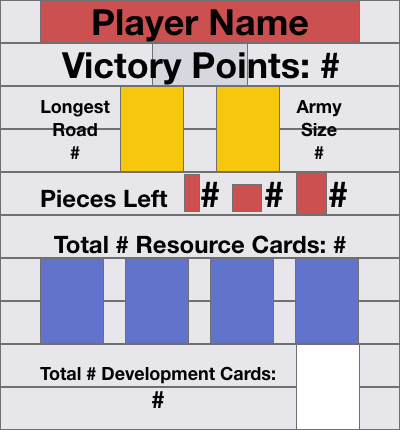

# Bryant Cabrera's Settlers of Catan

### A. Images
1. Wireframe

2. Uninitialized boardgame
3. Initialized boardgame
    1.  Randomized hex areas
    2.  Ordered number tokens that skip over the desert
### B. Technologies Used
1. HTML
    1. Block__Element--Method (BEM) class naming methodology
2. CSS
    1. grid
    2. flexbox
    3. absolute positioning
    3. clip-path
    3. box-shadow
    4. linear-gradient
    5. radial-gradient
    6. transitions
    7. skew
    7. pseudoclasses
    8. pseudoelements
3. JavaScript
    1. data structures
        1. objects
        2. arrays
    2. classes
    3. for loops, for of loops, for in loops
    4. array iterator methods
    3. switch statements
    4. ternaries
    5. callbacks
    6. closures
    7. slice, splice
4. jQuery
    1. event listeners
    2. value retrieval
    3. animations
5. Velocity
    1. animations
6. IonIcons
    1. link icons
### C. Getting Started
1. Link to deployed game
2. Instructions
    1. In the header, in the links on the top right, click **"INSTRUCTIONS"** to learn how to play Settlers of Catan
    2. In the header, in the links on the top right, click **"GAME"** to be taken to the **"CONTROLS"** section (top middle of the main section with a light brown background) of the game
    3. In the **"CONTROLS"** section, click the **"NEW GAME"** button to initialize the boardgame
    4. In the **"CONTROLS"** section , click on the number of players you want to play the game
    5. Read the **"MESSAGE WINDOW"** (light grey, slightly opaque background on top of the light blue background) right underneath the "CONTROLS" section to figure out which player gets to be first.
    6. You are now in the **"INITIAL PHASE"** of the game.  Follow the instructions **"MESSAGE WINDOW"**.  Players will place 1 settlement and 1 road each starting from the first player until every player gets to do this.  This happens a second time, but then starts with the last player who placed until it reaches the 1st player.  After this phase, the **"MESSAGE WINDOW"** will tell you when the game is **"IN PROGRESS"**.
    7. On a player's turn, the **DICE** will automatically roll for you and the **"CONSTROLS"** section will change to show the player's action buttons.  
    8.  The player has the following actions available to them:
        -  Build Road
        -  Build Settlement
        -  Build City
        -  Trade
        -  Buy/Use Development Card
        -  Cancel current selection
        -  End Turn
### D. Next Steps
1. Unsolved problems
    - [ ] Resource distribution should only occur if that resource's quantity is greater than 0 in bank
2. Planned features
    - [ ] Ability to rename player
    - [ ] Ability to move the robber when a 7 is rolled
    - [ ] change clip path of settlements and cities placed on board
    - [ ] Harbor areas that change trade rates with the bank
        1. Harbor images on the DOM
        2. Randomize harbor areas
    - [ ] Development Card methods