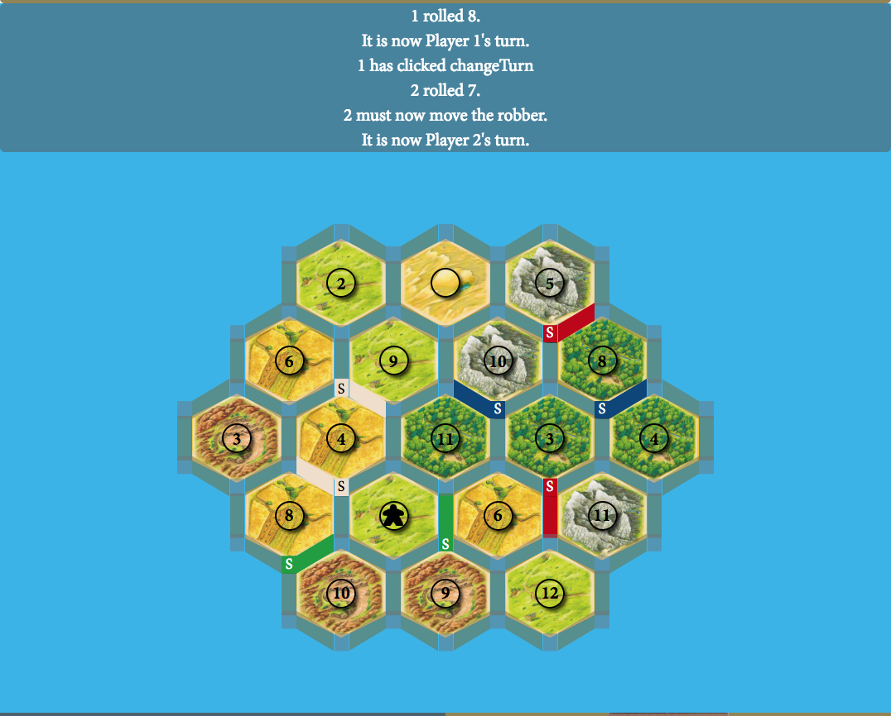
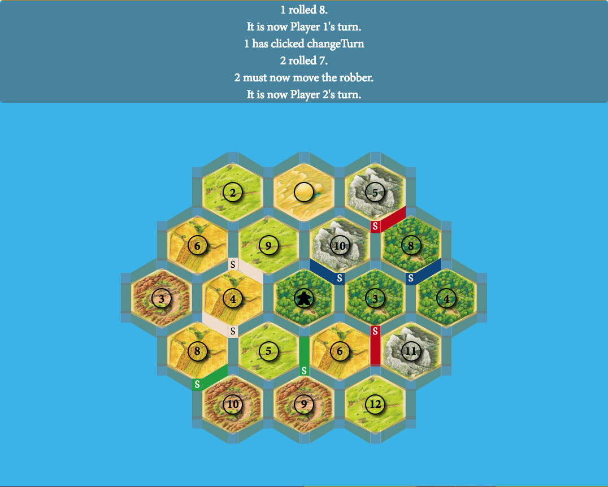

# Bryant Cabrera's Settlers of Catan

### A. Description
Bryant Cabrera's Settlers of Catan is a web-based adaptation of the popular boardgame "Settlers of Catan" by Klaus Teuber.  The game is a multiplayer, turn-based strategy, resource management boardgame.  Players' logic, management, and negotiation skills will be tested.  Welcome to Catan!

More info about the game can be found on the [Official Settlers of Catan Website](https://www.catan.com/game/catan).

### B. Images
1. Wireframe

2. Uninitialized boardgame

3. Initialized boardgame

    1.  Randomized hex areas
    2.  Ordered number tokens that skip over the desert

### C. Technologies Used
1. HTML
    1. Block__Element--Method (BEM) class naming methodology
2. CSS
    1. grid
    2. flexbox
    3. absolute positioning
    3. clip-path
    3. box-shadow
    4. linear-gradient
    5. radial-gradient
    6. transitions
    7. skew
    7. pseudoclasses
    8. pseudoelements
3. JavaScript
    1. data structures
        1. objects
            1. object property getter
        2. arrays
    2. classes
    3. for loops, for of loops, for in loops
    4. array iterator methods
    3. switch statements
    4. ternaries
    5. callbacks
    6. closures
    7. slice, splice
4. jQuery
    1. event listeners
    2. value retrieval
    3. animations
5. jQuery Modal
6. Velocity
    1. animations
7. IonIcons
    1. link icons

### D. Getting Started
1. Link to deployed game:
[GitHub Pages Deployed Game](https://bryantcabrera.github.io/Settlers-of-Catan/#)
2. Instructions
    1. In the header, in the links on the top right, click **"INSTRUCTIONS"** to learn how to play Settlers of Catan
    
    2. In the header, in the links on the top right, click **"GAME"** to be taken to the **"CONTROLS"** section (top middle of the main section with a light brown background) of the game
    3. In the **"CONTROLS"** section, click the **"NEW GAME"** button to initialize the boardgame
    
    4. In the **"CONTROLS"** section , click on the number of players you want to play the game
    
    5. Read the **"MESSAGE WINDOW"** (light grey, slightly opaque background on top of the light blue background) right underneath the "CONTROLS" section to figure out which player gets to be first.
    
    6. You are now in the **"INITIAL PHASE"** of the game.  Follow the instructions in the **"MESSAGE WINDOW"**.  Players will place 1 settlement and 1 road each starting from the first player until every player gets to do this.  This happens a second time, but then starts with the last player who placed until it reaches the 1st player.  After this phase, the **"MESSAGE WINDOW"** will tell you when the game is **"IN PROGRESS"**.
    7. On a player's turn, the **DICE** will automatically roll for him/her.   
        > Based on what number was rolled, players with settlements on the hex whose number was rolled will get the corresponding resource to that area.
            > Forests produce *lumber*, Hills produce *brick*, Pastures produce *wool*, Fields produce *grain*, and Mountains produce *ore*.
        

        > If a 7 was rolled, the player must select where to place the robber before the turn can continue.  For anywhere except the desert, the robber blocks any settlement touching his/her hex from producing resources on the given roll value.  If the robber is moved to a different hex, the original number token will be placed back onto the hex he is departing from.
        
        
        

        > The **"CONTROLS"** section will change to show the **"Player's Action Section"**.
        
    8.  The player has the following actions available to them:
        -  Build Road
            > A road can only be built next to one of your existing settlements/cities or roads.
            
            
        -  Build Settlement (Worth 1 VP, denoted by an S)
        
        -  Build City (Worth 2 VP, denoted by a C)
        
        -  Trade
            > Select which player you want to trade with
            
            > Select what you want to trade
            
        -  Buy/Use Development Card
            > Feature not implemented yet
        -  End Turn
    9.  At anytime, the player can cancel the current action selection by clicking the **"CANCEL"** button that populates in the **"CONTROLS"** section
    
    10.  When the player hits the **"END TURN"** button in the **"Player's Action Section"**, the turn is changed.
    11.  Gameplay continues until someone reaches 10 victory points.  If a player has 10 actual victory points (visible points + hidden points) after ending his/her turn, he/she wins the game.
        > Hidden victory points are earned from development cards (*feature not yet implemented*) and are kept secret from other players.
    

### E. Next Steps
1. Unsolved problems
    - [ ] Resizing for certain mobile devices causes elements to overlap rather than overflow
2. Planned features
    - [ ] Ability to rename player
    - [ ] When 7 is rolled, players with over 7 totalResource cards must discard half of their cards rounded down
    - [ ] Check Longest Road & Largest Army game methods
    - [ ] change clip path of settlements and cities placed on board
    - [ ] proper trade rates with bank (4 of the same of 1 of your resources for any 1 from the bank)
    - [ ] cannot trade nothing away in exchange for something (must at least be a 1:1 trade)
    - [ ] Harbor areas that change trade rates with the bank
        - [ ] Harbor images on the DOM
        - [ ] Randomize harbor areas
    - [ ] Development Card methods